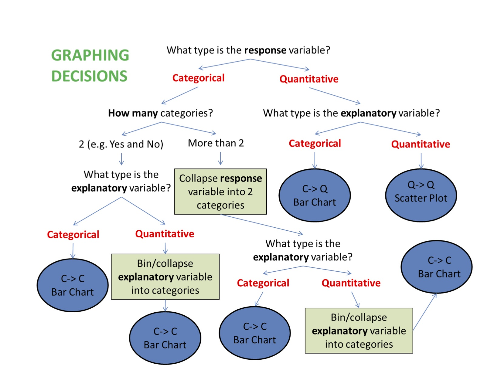

# Chapter 9
### Graphing Relationships

So far we have dealt with data obtained from one variable (either categorical or quantitative) and learned how to describe the distribution of the variable using the appropriate visual displays and numerical measures. In this section, examining relationships, we will look at two variables at a time and, as the title suggests, explore the relationship between them using (as before) visual displays and numerical summaries.

While it is fundamentally important to know how to describe the distribution of a single variable, most studies (including yours) pose research questions that involve exploring the relationship between two variables.

Here are a few examples of such research questions with the two variables highlighted:

**Examples:**

1. Is there a relationship between gender and test scores on a particular standardized test?

Other ways of phrasing the same research question:

* Is performance on the test related to gender?
* Is there a gender effect on test scores?
* Are there differences in test scores between males and females?

2. Is there a relationship between the type of light a baby sleeps with (no light, night-light, lamp) and whether the child develops nearsightedness?

3. Are the smoking habits of a person (yes, no) related to the person's gender?

4. How well can we predict a student's freshman year GPA from his/her SAT score?

In most analyses involving two variables, each of the variables has a role. We distinguish between:

* the *response* variable (also known as the dependent variable (DV), or outcome)
* the *explanatory* variable (also known as the independent variable (IV), or the predictor)

At this point, we will be asking you to **“impose” a causal model** on your research question, despite the fact that you will not be able to directly evaluate a causal relationship. This video defines the two types of variables you will be identifying and shows you how this decision will guide the kinds of graphing you do and the kind of statistical tests that you will ultimately use. Please watch [GRAPHING 2 video](https://www.youtube.com/watch?v=Yf121fdtjDA&index=55&list=PLDEF0B9CBD27AD37E).



When graphing your data, it is important that each graph provides clear and accurate summaries of the data that do not mislead. Please watch [GRAPHING RULES video](https://www.youtube.com/watch?v=JVq2VKib0vw&index=21&list=PLDEF0B9CBD27AD37E) for a few basic graphing guidelines to help you accomplish this goal.


#### Bivariate Graphing

(C $\rightarrow$ C) Prevalence of Nicotine Dependence (C) by Depression Status (C) (among current, daily, young adult smokers)

```{r, fig.width = 8, fig.height = 4}
library(ggplot2)
library(PDS)
library(dplyr)
nesarc <- tbl_df(NESARC) %>%
  filter(S3AQ1A ==1 & S3AQ3B1 == 1 & CHECK321 == 1 & AGE <= 25) %>% 
  rename(Ethnicity = ETHRACE2A, Age = AGE, MajorDepression = MAJORDEPLIFE, 
         Sex = SEX, TobaccoDependence = TAB12MDX, DailyCigsSmoked = S3AQ3C1) %>% 
  select(Ethnicity, Age, MajorDepression, TobaccoDependence, DailyCigsSmoked, Sex)
#
nesarc$DailyCigsSmoked[nesarc$DailyCigsSmoked == 99] <- NA  # coding missing values
# Label stuff
nesarc$Ethnicity <- factor(nesarc$Ethnicity, 
                           labels = c("Caucasian", "African American", 
                                      "Native American", "Asian", "Hispanic"))
nesarc$TobaccoDependence <- factor(nesarc$TobaccoDependence, 
                                   labels = c("No Nicotine Dependence", 
                                              "Nicotine Dependence"))
nesarc$Sex <- factor(nesarc$Sex, labels =c("Female", "Male"))
nesarc$MajorDepression <- factor(nesarc$MajorDepression, 
                                 labels =c("No Depression", "Yes Depression"))
ggplot(data = nesarc, aes(x = MajorDepression, fill = TobaccoDependence)) + 
  geom_bar(position = "fill") +
  theme_bw() + 
  labs(x = "", y = "Fraction", 
       title = "Fraction of young adult daily smokers\nwith and without nicotine addiction\nby depression status") + 
  scale_fill_manual(values = c("green", "red"), name = "Tobacco Addiction Status")
```

#### Multivariate Graphing

```{r, fig.width = 8, fig.height = 4}
ggplot(data = nesarc, aes(x = MajorDepression, fill = TobaccoDependence)) + 
  geom_bar(position = "fill") +
  theme_bw() + 
  labs(x = "", y = "Fraction", title = "Fraction of young adult daily smokers\nwith and without nicotine addiction\nby depression status") + 
  scale_fill_manual(values = c("green", "red"), name = "Tobacco Addiction Status") +
facet_grid(Sex ~ .)
```

#### Bivariate Graphing 

(Q $\rightarrow$ Q)

```{r}
library(PASWR2)
ggplot(data = GRADES, aes(x = sat, y = gpa)) + 
  geom_point(color = "lightblue") + 
  theme_bw() +
  labs(x = "SAT score", y = "First semester college Grade Point Average") +
  geom_smooth(method = "lm")
```

Graphs that seem to provide important information can in fact be erroneous. Please watch the [COMMON GRAPHING MISTAKES VIDEO](https://www.youtube.com/watch?v=iY_t31-R_xU&index=25&list=PLDEF0B9CBD27AD37E) (3:35).

#### Bivariate Graphing Assignment

Post a graph showing the association between your explanatory and response variables (bivariate graph) on your private GitHub repository. Include a second graph of your bivariate graph by a third variable (multivariate graph). Write a few sentences describing what your graphs show.

#### Note to Alan --- Augment the graphs and code shown here.
