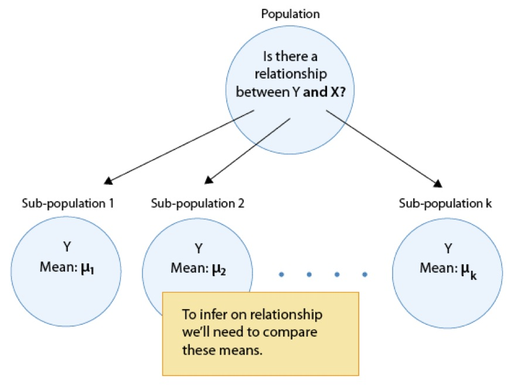
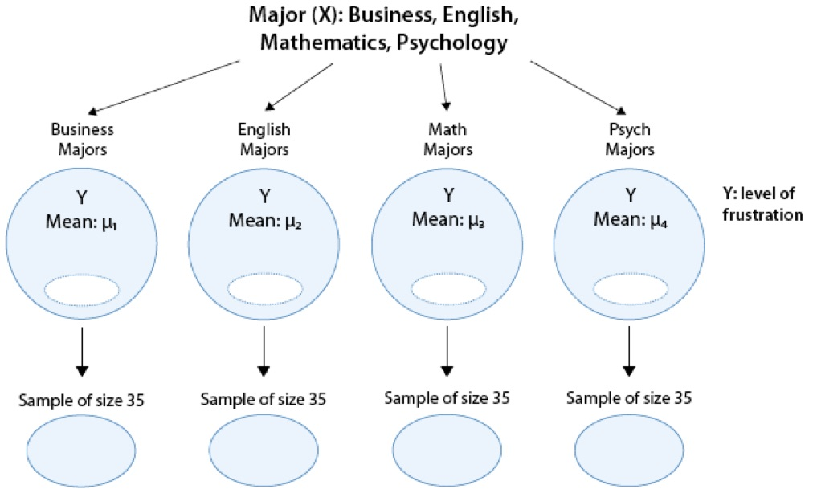

# Chapter 11
### Analysis of Variance $C \rightarrow Q$

Please watch the [Analysis of Variance video](https://www.youtube.com/watch?v=XRKrSJAwGUo&list=PLDEF0B9CBD27AD37E&index=56).

In our description of hypothesis testing in the previous chapter, we started with case $C \rightarrow Q$, where the explanatory variable/independent variable/predictor ($X$ = major depression) is categorical and the response variable/dependent variable/outcome ($Y$ = number of cigarettes smoked) is quantitative. Here is a similar example:

**GPA and Year in College**

Say that our variable of interest is the GPA of college students in the United States. Since GPA is quantitative, we do inference on $\mu$, the (population) mean GPA among all U.S. college students. We are really interested in the relationship between GPA and college year:

$X$: year in college (1 = freshmen, 2 = sophomore, 3 = junior, 4 = senior) and
$Y$: GPA

In other words, we want to explore whether GPA is related to year in college. The way to think about this is that the population of U.S. college students is now broken into 4 sub-populations: freshmen, sophomores, juniors, and seniors. Within each of these four groups, we are interested in the GPA.


The inference must therefore involve the 4 sub-population means:

* $\mu_1$: mean GPA among freshmen in the United States
* $\mu_2$: mean GPA among sophomores in the United States 
* $\mu_3$: mean GPA among juniors in the United States
* $\mu_4$: mean GPA among seniors in the United States

It makes sense that the inference about the relationship between year and GPA has to be based on some kind of comparison of these four means. If we infer that these four means are not all equal (i.e., that there are some differences in GPA across years in college) then that's equivalent to saying GPA is related to year in college. Let's summarize this example with a figure:


In general, then, making inferences about the relationship between $X$ and $Y$ in Case $C\rightarrow Q$ boils down to comparing the means of $Y$ in the sub-populations, which are created by the categories defined in $X$ (say $k$ categories). The following figure summarizes this:



The inferential method for comparing means is called Analysis of Variance (abbreviated as ANOVA), and the test associated with this method is called the ANOVA F-test. We will first present our leading example, and then introduce the ANOVA F-test by going through its 4 steps, illustrating each one using the example.

*Is "academic frustration" related to major?*

A college dean believes that students with different majors may experience different levels of academic frustration. Random samples of size 35 of Business, English, Mathematics, and Psychology majors are asked to rate their level of academic frustration on a scale of 1 (lowest) to 20 (highest).



The figure highlights that examining the relationship between major ($X$) and frustration level ($Y$) amounts to comparing the mean frustration levels ($\mu_1, \mu_2,\mu_3,\mu_4$) among the four majors defined by $X$.

**The ANOVA F-Test**

Now that we understand in what kind of situations ANOVA is used, we are ready to learn how it works.

**Stating the Hypotheses**

The null hypothesis claims that there is no relationship between $X$ and $Y$. Since the relationship is examined by comparing $\mu_1, \mu_2,\ldots,\mu_k$ (the means of $Y$ in the populations defined by the values of $X$), no relationship would mean that all the means are equal. Therefore the null hypothesis of the F-testis: $H_0: \mu_1 = \mu_2 = \cdots = \mu_k$.

As we mentioned earlier, here we have just one alternative hypothesis, which claims that there is a relationship between $X$ and $Y$.  In terms of the means $\mu_1, \mu_2,\ldots,\mu_k$ it simply says the opposite of the alternative, that not all the means are equal, and we simply write: $H_a:$ not all the $\mu$'s are equal.

Recall our "Is academic frustration related to major?" example:


**Review: True or False**

The hypothesis that are being test in our example are:

$H_0: \mu_1 = \mu_2 = \mu_3 = \mu_4$

$H_1: \mu_1 \neq \mu_2 \neq \mu_3 \neq \mu_4$

The correct hypotheses for our example are:

$H_0: \mu_1 = \mu_2 = \mu_3 = \mu_4$

$H_1: \mu_i \neq \mu_j$ for some $i,j$

Note that there are many ways for $\mu_1, \mu_2,\mu_3,\mu_4$ not to be all equal, and $\mu_1 \neq \mu_2 \neq \mu_3 \neq \mu_4$ is just one of them. Another way could be $\mu_1 = \mu_2 = \mu_3 \neq \mu_4$ or $\mu_1 = \mu_2 \neq \mu_3 \neq \mu_4$.  The alternative of the ANOVA F-test simply states that not all of the means are equal and is not specific about the way in which they are different.

**The Idea Behind the ANOVA F-Test**

Let's think about how we would go about testing whether the population means $\mu_1, \mu_2,\mu_3,\mu_4$ are equal. It seems as if the best we could do is to calculate their point estimates—the sample mean in each of our 4 samples (denote them by $\bar{x}_1,\bar{x}_2,\bar{x}_3,\bar{x}_4),


and see how far apart these sample means are, or, in other words, measure the variation between the sample means. If we find that the four sample means are not all close together, we'll say that we have evidence against $H_0$, and otherwise, if they are close together, we'll say that we do not have evidence against $H_0$. This seems quite simple, but is this enough? Let's see.

It turns out that:

```{r}
library(PDS)
MEANS <- with(data = frustration, 
              tapply(Frustration.Score, Major, mean)
)
MEANS
```

* The sample mean frustration score of the 35 business majors is: $\bar{x}_1 = `r MEANS[1]`$
* The sample mean frustration score of the 35 English majors is: $\bar{x}_2 = `r MEANS[2]`$
* The sample mean frustration score of the 35 mathematics majors is: $\bar{x}_3 = `r MEANS[3]`$
* The sample mean frustration score of the 35 psychology majors is: $\bar{x}_4 = `r MEANS[4]`$


We present two possible scenarios for our example (different data). In both cases, we construct side-by-side box plots (showing the distribution of the data including the range, lowest and highest values, the mean, etc.) four groups of frustration levels that have the same variation among their means. Thus, Scenario #1 and Scenario #2 both show data for four groups with the sample means `r MEANS[1]`, `r MEANS[2]`, `r MEANS[3]`, and `r MEANS[4]`.

```{r, echo = FALSE}
library(dplyr)
frus <- frustration %>% 
  arrange(Major, Frustration.Score) %>% 
  mutate(Frustration.Score = Frustration.Score + rep(seq(-25, 25, length = 35), 4))
ggplot(data = frus, aes(x = Major, y = Frustration.Score)) + geom_boxplot() + theme_bw() + 
  labs(x = "", y = "Frustration Score", title = "Scenario 1")
ggplot(data = frustration, aes(x = Major, y = Frustration.Score)) + geom_boxplot() + theme_bw() + 
  labs(x = "", y = "Frustration Score", title = "Scenario 2")
```
  
**Review 11.2 Multiple Choice**

Look carefully at the graphs of both scenarios. For which of the two scenarios would you be willing to believe that samples have been taken from four groups which have the same population means?

A. Scenario 1

B. Scenario 2

The important difference between the two scenarios is that the first represents data with a large amount of variation within each of the four groups; the second represents data with a small amount of variation within each of the four groups.

Scenario 1, because of the large amount of spread within the groups, shows box plots with plenty of overlap. One could imagine the data arising from 4 random samples taken from 4 populations, all having the same mean of about 11 or 12. The first group of values may have been a bit on the low side, and the other three a bit on the high side, but such differences could conceivably have come about by chance. This would be the case if the null hypothesis, claiming equal population means, were true. Scenario 2, because of the small amount of spread within the groups, shows boxplots with very little overlap. It would be very hard to believe that we are sampling from four groups that have equal population means. This would be the case if the null hypothesis, claiming equal population means, were false.

Thus, in the language of hypothesis tests, we would say that if the data were configured as they are in scenario 1, we would not reject the null hypothesis that population mean frustration levels were equal for the four majors. If the data were configured as they are in scenario 2, we would reject the null hypothesis, and we would conclude that mean frustration levels differ depending on major.

Let's summarize what we learned from this. The question we need to answer is: Are the differences among the sample means ($\bar{x}'s) due to true differences among the $\mu$'s (alternative hypothesis), or merely due to sampling variability (null hypothesis)?

In order to answer this question using our data, we obviously need to look at the variation among the sample means, but this alone is not enough. We need to look at the variation among the sample means relative to the variation within the groups. In other words, we need to look at the quantity:

$$\frac{\text{VARIATION AMONG SAMPLE MEANS}}{\text{VARIATION WITHIN GROUPS}}$$

which measures to what extent the difference among the sampled groups' means dominates over the usual variation within sampled groups (which reflects differences in individuals that are typical in random samples).

When the variation within groups is large (like in scenario 1), the variation (differences) among the sample means could become negligible and the data provide very little evidence against $H_0$.  When the variation within groups is small (like in scenario 2), the variation among the sample means dominates over it, and the data have stronger evidence against $H_0$.  Looking at this ratio of variations is the idea behind the comparison of means; hence the name analysis of variance (ANOVA).

**Did I Get This?**

Consider the following generic situation:


where we're testing:

$H_0: \mu_1 = \mu_2 = \mu_3$ versus $H_a:\mu_i \neq \mu_j$ for some $i,j$ or not all $\mu$'s are equal.

```{r, echo = FALSE}
set.seed(2)
s1 <- rnorm(100, 25, 2)
s2 <- rnorm(100, 30, 2)
s3 <- rnorm(100, 35, 2)
DF <- data.frame(s1, s2, s3)
DF1 <- stack(DF)
DF2 <- DF1 %>% 
  arrange(values, ind) %>% 
  mutate(values = values + rep(seq(-10, 10, length = 100), 3))
MEANS <- with(data = DF1,
     tapply(values, ind, mean)
     )
```

The following are two possible scenarios of the data (note in both scenarios the sample means are `r MEANS[1]`, `r MEANS[2]`, and `r MEANS[3]`).

```{r, echo = FALSE, fig.width = 8}
library(PASWR2)
p1 <- ggplot(data = DF1, aes(x = values, fill = ind)) + geom_density(alpha = 0.2) + theme_bw()
p2 <- ggplot(data = DF1, aes(x = ind, y = values)) + geom_boxplot() + theme_bw() + coord_flip()
p3 <- ggplot(data = DF2, aes(x = values, fill = ind)) + geom_density(alpha = 0.2) + theme_bw()
p4 <- ggplot(data = DF2, aes(x = ind, y = values)) + geom_boxplot() + theme_bw() + coord_flip()
multiplot(p1, p2, cols = 1)
multiplot(p3, p4, cols = 1)
```